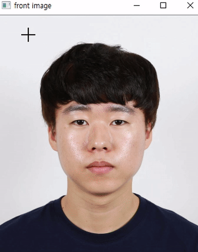
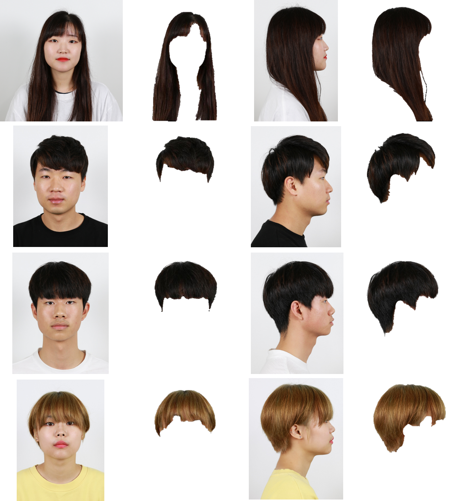

# Hair_segmentation
Preprocessing for 3D hair modeling

## Introduction
Hair segmentation basoed on grab-cut. Grab-cut will extract foregound in images.
1. select rectangle & user stroke – outside rectangle is background
2. initial labelling(foreground or background)
3. model the foreground and background using Gaussian Mixture Model(GMM)
4. label foreground or background each pixel

## Results

